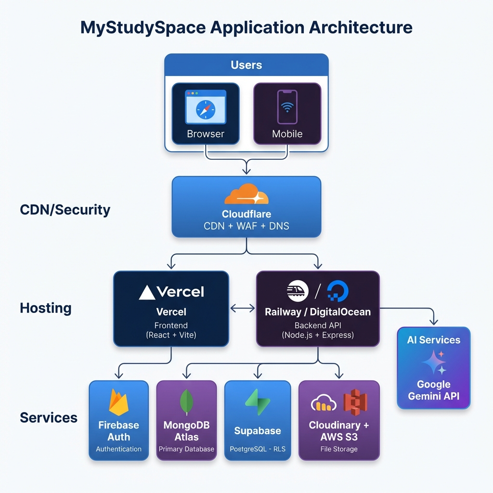
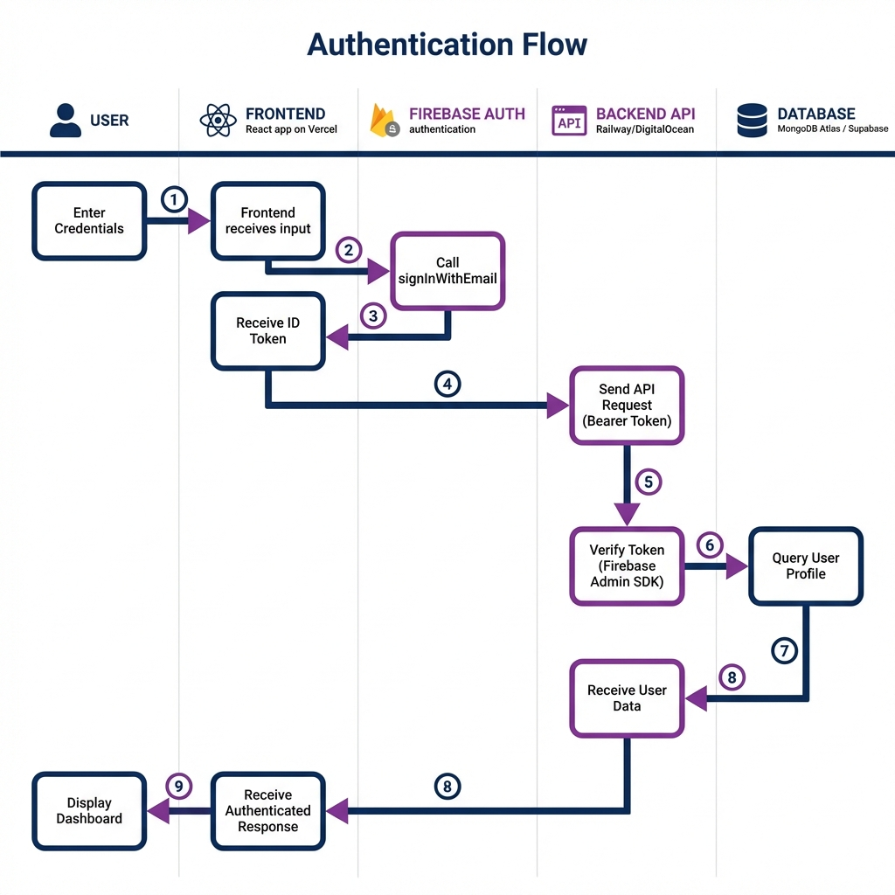
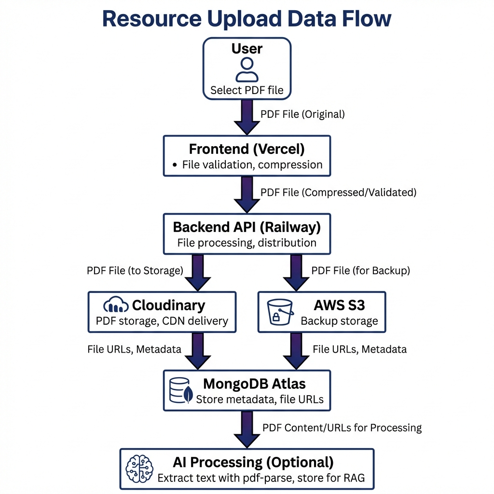
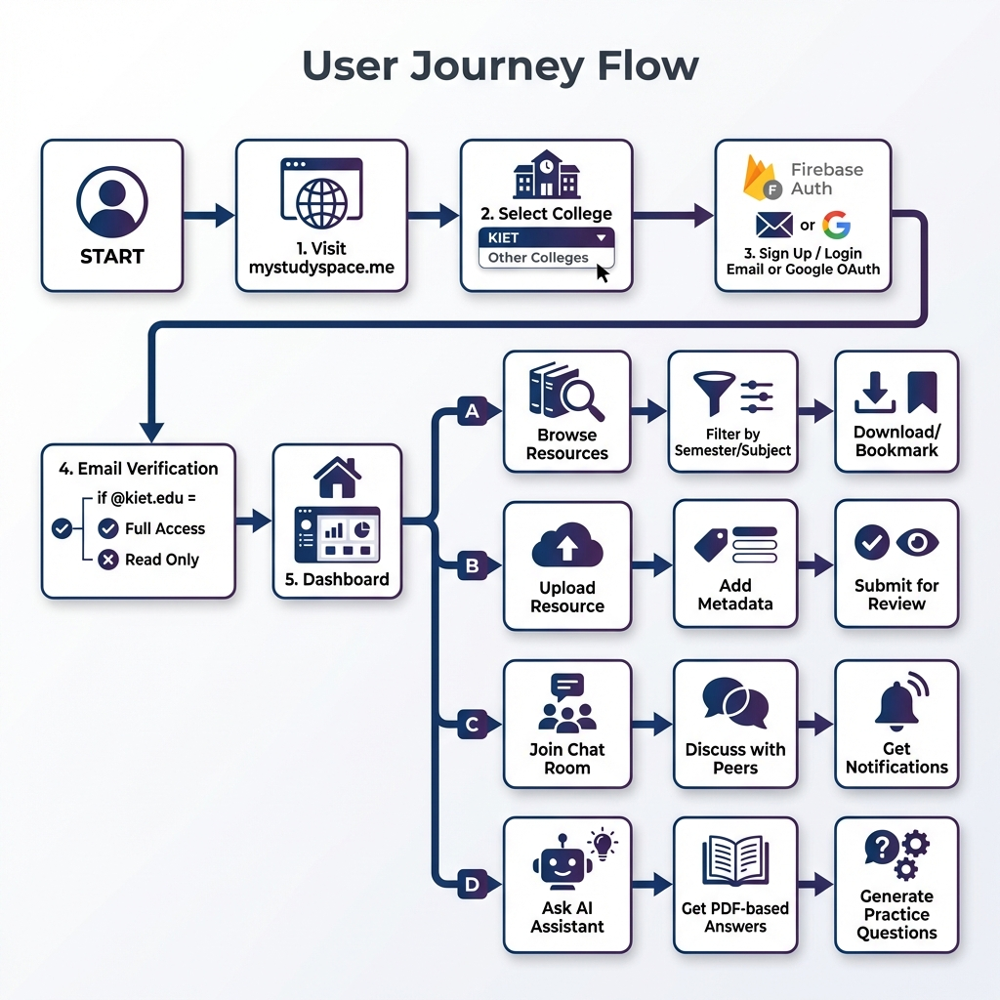

# Studyshare Platform Documentation

**Version:** 2.0  
**Date:** January 2026  
**Domain:** studyshare.me  
**Classification:** CONFIDENTIAL - Internal Use Only

---

## Table of Contents

1. [Executive Summary](#1-executive-summary)
2. [Problem Statement](#2-problem-statement)
3. [Product Features](#3-product-features)
4. [User Roles & Permissions](#4-user-roles--permissions)
5. [System Architecture](#5-system-architecture)
6. [Technology Stack](#6-technology-stack)
7. [Data Flow](#7-data-flow)
8. [User Journey](#8-user-journey)
9. [Database Design](#9-database-design)
10. [Security Architecture](#10-security-architecture)
11. [Performance & Scalability](#11-performance--scalability)
12. [Privacy & Compliance](#12-privacy--compliance)
13. [Future Roadmap](#13-future-roadmap)

---

## 1. Executive Summary

### Platform Overview

Studyshare is a community-driven academic resource sharing platform designed for college students to access, share, and collaborate on study materials. The platform creates a centralized ecosystem for educational content with AI-powered assistance.

### Mission

To democratize access to quality study materials by enabling peer-to-peer resource sharing within verified college communities.

### Key Metrics

| Metric | Value |
|--------|-------|
| Target Institution | Krishna Institute of Engineering and Technology (KIET) |
| Supported Semesters | 1-8 |
| Resource Types | Notes, PYQs, Video Links |
| Access Modes | Full (verified email), Read-Only (guest) |

---

## 2. Problem Statement

### Challenges Addressed

| Challenge | Solution |
|-----------|----------|
| Scattered Resources | Centralized repository with organized categorization |
| Quality Uncertainty | Community voting system for content validation |
| Community Isolation | Chat rooms and threaded comments for collaboration |
| Information Overload | Smart filtering by semester, branch, subject |
| Lack of AI Support | Integrated AI assistant for study help |

---

## 3. Product Features

### Core Features

| Feature | Description | Status |
|---------|-------------|--------|
| Resource Library | Upload, browse, and download PDFs, notes, and videos | Live |
| Smart Filtering | Filter by semester, branch, subject, chapter | Live |
| Community Voting | Upvote/downvote resources for quality surfacing | Live |
| Bookmarking | Save resources for quick access | Live |
| Following System | Follow content creators and get updates | Live |

### Communication Features

| Feature | Description | Status |
|---------|-------------|--------|
| Chat Rooms | Topic-based discussion rooms (public/private) | Live |
| Threaded Comments | Reddit-style nested comments on posts | Live |
| College Notices | Official announcement system | Live |
| Notifications | Real-time alerts for follows, replies, mentions | Live |

### AI Features

| Feature | Description | Status |
|---------|-------------|--------|
| AI Study Assistant | Chat with AI about course materials | Live |
| PDF-Aware Answers | AI reads uploaded PDFs to answer questions | Live |
| Question Generation | Generate practice questions from study materials | Live |

---

## 4. User Roles & Permissions

### Role Hierarchy

| Role | Email Requirement | Permissions |
|------|-------------------|-------------|
| Administrator | Manual assignment | Full access, user moderation, content management |
| Verified User | @kiet.edu domain | Upload, comment, vote, create rooms |
| Read-Only User | Any email | View resources, download, browse only |

### Permission Matrix

| Action | Read-Only | Verified | Admin |
|--------|-----------|----------|-------|
| View resources | Yes | Yes | Yes |
| Download resources | Yes | Yes | Yes |
| Upload resources | No | Yes | Yes |
| Comment on posts | No | Yes | Yes |
| Vote on content | No | Yes | Yes |
| Create chat rooms | No | Yes | Yes |
| Ban users | No | No | Yes |
| Delete any content | No | Own only | Yes |

---

## 5. System Architecture

### Architecture Overview

### Infrastructure Components

| Layer | Service | Purpose |
|-------|---------|---------|
| CDN/Security | Cloudflare | DNS, WAF, DDoS protection, SSL |
| Frontend Hosting | Vercel | Edge deployment, React SPA |
| Backend Hosting | Railway / DigitalOcean | Node.js API server |
| Authentication | Firebase Auth | Google OAuth, Email/Password |
| Primary Database | MongoDB Atlas | NoSQL document storage |
| Legacy Database | Supabase (PostgreSQL) | RLS policies, transitioning |
| File Storage | Cloudinary + AWS S3 | PDF hosting, CDN delivery, backup |
| AI Services | Google Gemini API | Chat assistant, question generation |

---

## 6. Technology Stack

### Frontend

| Technology | Purpose |
|------------|---------|
| React 18 | UI framework with hooks and concurrent features |
| Vite | Build tool and dev server |
| Tailwind CSS | Utility-first styling |
| shadcn/ui | Component library |
| React Query | Server state management with caching |
| React Router | Client-side routing |

### Backend

| Technology | Purpose |
|------------|---------|
| Node.js | Runtime environment |
| Express.js | REST API framework |
| TypeScript | Type-safe development |
| Firebase Admin SDK | Token verification |
| pdf-parse | PDF text extraction for AI |
| Mongoose | MongoDB ODM |

### DevOps

| Service | Purpose |
|---------|---------|
| Vercel | Frontend CI/CD and hosting |
| Railway | Backend deployment (primary) |
| DigitalOcean | Backend deployment (backup) |
| GitHub | Version control |

---

## 7. Data Flow

### Authentication Flow

**Steps:**
1. User enters credentials on frontend
2. Frontend calls Firebase `signInWithEmail`
3. Firebase returns ID Token
4. Frontend sends API request with Bearer token
5. Backend verifies token with Firebase Admin SDK
6. Backend queries user profile from database
7. Database returns user data
8. Backend returns authenticated response
9. Frontend displays dashboard

### Resource Upload Flow

**Steps:**
1. User selects PDF file
2. Frontend validates file type and size
3. Backend receives and processes file
4. File uploaded to Cloudinary (primary) and AWS S3 (backup)
5. Metadata stored in MongoDB Atlas
6. Optional: Text extracted for AI RAG pipeline

---

## 8. User Journey

### Complete User Flow

### Registration Flow

1. User visits studyshare.me
2. Selects college from dropdown
3. Signs up with email or Google OAuth
4. Email verification sent
5. Access level determined:
   - @kiet.edu email → Full Access
   - Other email → Read-Only Access

### Core User Paths

| Path | Steps |
|------|-------|
| Browse Resources | Filter → Search → View → Download/Bookmark |
| Upload Resource | Select type → Add metadata → Upload file → Submit |
| Join Chat Room | Browse rooms → Enter code → Join → Discuss |
| Use AI Assistant | Open chat → Ask question → Get PDF-based answer |

---

## 9. Database Design

### MongoDB Collections

| Collection | Purpose | Key Fields |
|------------|---------|------------|
| users | User profiles | email, displayName, collegeId, role |
| resources | Study materials | title, type, semester, branch, subject, fileUrl |
| chat_rooms | Discussion rooms | name, isPrivate, joinCode, createdBy |
| chat_messages | Room messages | roomId, authorEmail, content, parentId |
| notifications | User alerts | userEmail, type, title, isRead |
| bookmarks | Saved resources | userEmail, resourceId |
| follows | Social connections | followerEmail, followingEmail, status |

### Supabase Tables (Legacy)

| Table | Purpose | RLS |
|-------|---------|-----|
| resources | Resources with voting | Yes |
| notices | College announcements | Yes |
| syllabi | Course syllabi | Yes |
| banned_users | User moderation | Yes |

---

## 10. Security Architecture

### Security Layers

| Layer | Implementation |
|-------|----------------|
| Transport | HTTPS everywhere (Cloudflare SSL) |
| CDN | Cloudflare WAF, DDoS protection |
| Authentication | Firebase Auth (JWT tokens) |
| Authorization | Role-based access, server-side verification |
| Database | MongoDB Atlas encryption, Supabase RLS |
| Bot Protection | reCAPTCHA v3 on sensitive actions |
| Rate Limiting | IP-based throttling per endpoint |

### Rate Limits

| Endpoint | Limit | Window |
|----------|-------|--------|
| Authentication | 10 requests | 15 minutes |
| AI Chat | 5 requests | 1 minute |
| File Upload | 20 requests | 1 hour |
| General API | 100 requests | 1 minute |

---

## 11. Performance & Scalability

### Optimization Strategies

| Strategy | Implementation |
|----------|----------------|
| Code Splitting | Route-based lazy loading with React.lazy() |
| CDN Caching | Cloudflare edge caching for static assets |
| Image Optimization | Cloudinary transformations, WebP format |
| API Response Caching | React Query with 5-minute stale time |
| Database Indexing | Compound indexes on frequently queried fields |

### Scalability

| Component | Scaling Strategy |
|-----------|------------------|
| Frontend | Vercel auto-scaling edge functions |
| Backend | Railway horizontal scaling |
| Database | MongoDB Atlas auto-sharding |
| Files | Cloudinary + AWS S3 global CDN |

---

## 12. Privacy & Compliance

### Data Collection

| Data Type | Purpose | Retention |
|-----------|---------|-----------|
| Email address | Authentication, notifications | Until account deletion |
| Profile info | Display, personalization | Until account deletion |
| Upload activity | Attribution, moderation | Permanent |
| Usage analytics | Performance monitoring | 90 days |

### User Rights

- Right to access personal data
- Right to data deletion (account removal)
- Right to data portability
- Opt-out of non-essential communications

---

## 13. Future Roadmap

### Phase 2: Product Enhancement (Q2 2026)

| Feature | Description | Status |
|---------|-------------|--------|
| Android App | Native Android app with Jetpack Compose, Material 3 | In Development |
| AI Content Summarization | Automatically create concise summaries of PDF documents | Planned |
| Intelligent Doubt Resolution | AI suggests relevant resources based on student queries | Planned |
| Admin Bulk Actions | Bulk approve/reject resources for administrators | Planned |

### Phase 3: AI Premium Features (Q3 2026)

| Feature | Description | Priority |
|---------|-------------|----------|
| Auto Question Generation | AI analyzes notes to generate practice questions | High |
| Plagiarism Detection | Check uploaded content for originality | Medium |
| Auto-Tagging | Automatically categorize and tag resources | Medium |
| Personalized Recommendations | ML-based content suggestions from study patterns | High |

### Phase 4: Platform Expansion (Q4 2026)

| Milestone | Target |
|-----------|--------|
| Multi-College Federation | 10+ colleges in Delhi-NCR |
| LMS Integration | Moodle, Canvas compatibility |
| Advanced Analytics | Engagement dashboards for colleges |
| B2B Sales Launch | First 3 paying institutional customers |

### Long-Term Vision (2027+)

- Pan-India expansion to 50+ engineering colleges
- 100,000+ active students on platform
- Revenue target: ₹10-12 lakhs ARR
- Native iOS app development
- Video streaming and live study sessions

---

**Document Classification:** CONFIDENTIAL  
**Distribution:** Internal Team Only  
**Last Updated:** January 15, 2026

© 2026 Studyshare. All rights reserved.
