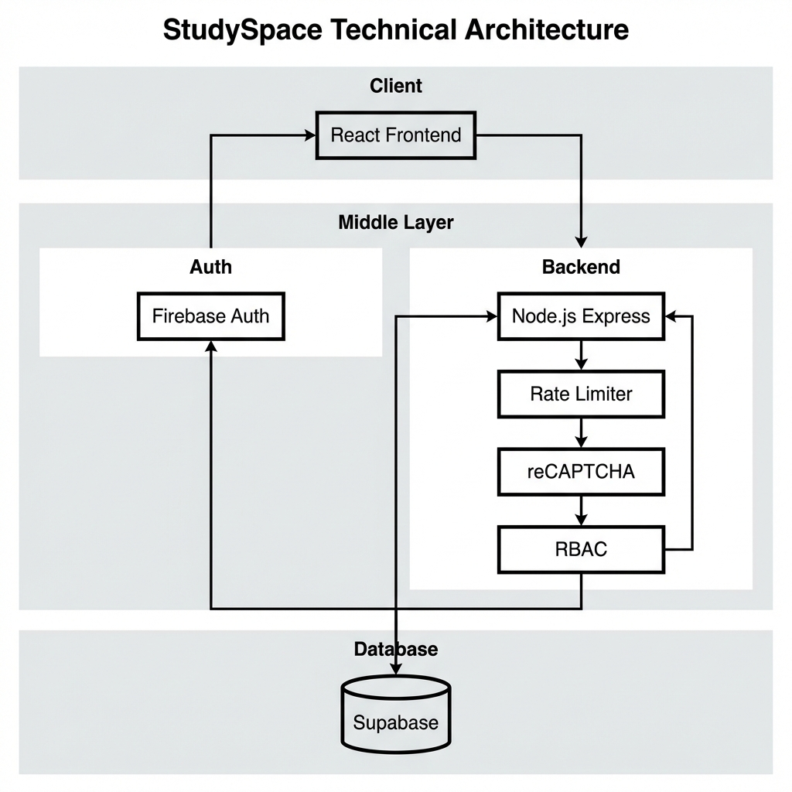

# StudySpace Platform Documentation

**Version:** 1.0  
**Date:** January 2026  
**Domain:** mystudyspace.me  
**Status:** Production

---

## Table of Contents

1. [Executive Summary](#1-executive-summary)
2. [Problem Statement](#2-problem-statement)
3. [Product Features](#3-product-features)
4. [User Roles & Permissions](#4-user-roles--permissions)
5. [System Architecture](#5-system-architecture)
6. [Architecture Diagram](#6-architecture-diagram)
7. [Data Flow](#7-data-flow)
8. [Database Design Overview](#8-database-design-overview)
9. [Security Architecture](#9-security-architecture)
10. [Performance Architecture](#10-performance-architecture)
11. [User Flow](#11-user-flow)
12. [Privacy & Data Protection](#12-privacy--data-protection)
13. [Platform Policies](#13-platform-policies)
14. [Scalability Considerations](#14-scalability-considerations)
15. [Future Roadmap](#15-future-roadmap)

---

## 1. Executive Summary

### Platform Overview

StudySpace is a community-driven academic resource sharing platform designed to transform how college students access, share, and collaborate on study materials. The platform bridges the gap between scattered academic resources and students who need them, creating a centralized ecosystem for educational content.

### Mission

To democratize access to quality study materials by enabling peer-to-peer resource sharing within verified college communities, fostering collaboration, and reducing academic isolation.

### Target Audience

- **Primary:** Undergraduate and postgraduate students
- **Secondary:** Faculty members, teaching assistants, and academic institutions
- **Tertiary:** Educational content creators and publishers

### Value Proposition

- **For Students:** Access curated, peer-reviewed study materials including notes, PDFs, videos, and previous year questions
- **For Institutions:** A monitored platform that encourages academic collaboration while maintaining content quality
- **For Content Creators:** A distribution channel with community feedback and engagement metrics

### Current Scale

- Active deployment for Krishna Institute of Engineering and Technology (KIET)
- Multi-college architecture ready for horizontal expansion
- Real-time user tracking and engagement analytics

---

## 2. Problem Statement

### The Academic Resource Challenge

Students face significant challenges in accessing quality study materials:

1. **Fragmentation of Resources**
   - Study materials scattered across WhatsApp groups, email chains, and personal drives
   - No centralized repository for institutional knowledge
   - Previous year questions and notes lost when students graduate

2. **Quality Uncertainty**
   - No mechanism to validate accuracy of shared materials
   - Difficulty distinguishing high-quality resources from subpar content
   - Lack of peer review systems for academic content

3. **Community Isolation**
   - Students study in silos without collaborative infrastructure
   - Limited inter-batch knowledge transfer
   - No platform for academic discussions and doubt resolution

4. **Information Overload**
   - Overwhelming amount of unorganized content
   - Time wasted searching for relevant materials
   - No personalization or filtering mechanisms

### Market Gap

Existing solutions focus on either:
- General file sharing (Google Drive, Dropbox) without academic context
- Formal LMS systems (Moodle) without community engagement
- Social networks without educational focus

StudySpace fills this gap by combining:
- Academic-focused file sharing
- Community engagement features
- Quality assurance through voting and moderation

---

## 3. Product Features

### Core Features

| Feature | Description | Status |
|---------|-------------|--------|
| Resource Library | Upload, browse, and download academic resources (notes, PDFs, videos, PYQs) | Live |
| Smart Filtering | Filter by semester, branch, subject, chapter, and topic | Live |
| Community Voting | Upvote/downvote resources to surface quality content | Live |
| Bookmarking | Save resources for quick access | Live |
| Following System | Follow content creators and departments | Live |

### Communication Features

| Feature | Description | Status |
|---------|-------------|--------|
| Chat Rooms | Topic-based discussion rooms (public and private) | Live |
| Threaded Comments | Reddit-style nested comments on posts and notices | Live |
| College Notices | Official announcement system for institutions | Live |
| Notifications | Real-time alerts for follows, replies, and announcements | Live |

### User Management

| Feature | Description | Status |
|---------|-------------|--------|
| Profile System | Customizable profiles with bio, photo cropper, and contributions | Live |
| Role-Based Access | Differentiated permissions for verified and read-only users | Live |
| User Discovery | Explore and connect with students from same college | Live |
| Contribution Tracking | Track uploads, votes received, and engagement | Live |

### Administrative Features

| Feature | Description | Status |
|---------|-------------|--------|
| Room Management | Create, delete, regenerate codes for chat rooms | Live |
| Member Moderation | Ban/unban members, manage room settings | Live |
| Notification Controls | Mute notifications per room | Live |
| Content Moderation | Report and review flagged content | Planned |

---

## 4. User Roles & Permissions

### Role Hierarchy

```
Administrator
    │
    ├── Verified User (@college.edu email)
    │       │
    │       └── Full Access
    │
    └── Read-Only User (any email)
            │
            └── Limited Access
```

### Permission Matrix

| Action | Read-Only User | Verified User | Administrator |
|--------|---------------|---------------|---------------|
| View resources | ✓ | ✓ | ✓ |
| Download resources | ✓ | ✓ | ✓ |
| Upload resources | ✗ | ✓ | ✓ |
| Comment on posts | ✗ | ✓ | ✓ |
| Vote on content | ✗ | ✓ | ✓ |
| Create chat rooms | ✗ | ✓ | ✓ |
| Join chat rooms | ✗ | ✓ | ✓ |
| Delete any content | ✗ | Own only | ✓ |
| Ban users | ✗ | ✗ | ✓ |
| Access admin panel | ✗ | ✗ | ✓ |

### Verification Logic

- **Verified Users:** Email domain matches registered college (e.g., @kiet.edu)
- **Read-Only Users:** Any valid email after college selection
- **Administrators:** Manually assigned via database flag

---

## 5. System Architecture

### Technology Stack

| Layer | Technology | Purpose |
|-------|------------|---------|
| Frontend | React 18 + Vite | Single Page Application |
| Styling | Tailwind CSS + shadcn/ui | Component library and styling |
| Backend | Node.js + Express | API server and business logic |
| Database | Supabase (PostgreSQL) | Data persistence with RLS |
| Authentication | Firebase Auth | Identity management |
| File Storage | Cloudinary | Media and document hosting |
| CDN/DNS | Cloudflare | Protection and performance |
| Frontend Hosting | Vercel | Edge deployment |
| Backend Hosting | Render | Container deployment |

### Layer Descriptions

#### Frontend Layer
- **React 18:** Modern UI framework with concurrent features
- **Vite:** Lightning-fast build tool and dev server
- **React Query:** Server state management with caching
- **React Router:** Client-side routing

#### Backend API Layer
- **Express.js:** RESTful API framework
- **CORS:** Configured for allowed origins only
- **Rate Limiting:** Request throttling per IP
- **Input Validation:** Request sanitization

#### Authentication Layer
- **Firebase Auth:** OAuth and email/password authentication
- **Token Verification:** Server-side JWT validation
- **Session Management:** Secure token handling

#### Database Layer
- **PostgreSQL:** ACID-compliant relational database
- **Row Level Security:** Per-row access control
- **Service Role:** Backend-only write access
- **Anonymous Role:** Frontend read access (select only)

#### Storage Layer
- **Cloudinary:** Optimized image delivery
- **Transformation:** On-the-fly image resizing
- **CDN:** Global edge caching

#### Security Layer
- **Cloudflare:** DDoS protection, WAF
- **reCAPTCHA v3:** Bot prevention
- **HTTPS:** End-to-end encryption

---

## 6. Architecture Diagram

### Visual Architecture



### Textual Architecture Diagram

```
┌─────────────────────────────────────────────────────────────────────┐
│                         CLIENT LAYER                                │
│  ┌─────────────────────────────────────────────────────────────┐   │
│  │              React + Vite Application                        │   │
│  │          (mystudyspace.me - Vercel Edge)                     │   │
│  └─────────────────────────────────────────────────────────────┘   │
└─────────────────────────────────────────────────────────────────────┘
                                  │
                    ┌─────────────┼─────────────┐
                    ▼             ▼             ▼
┌─────────────────────┐  ┌─────────────┐  ┌─────────────────┐
│   Cloudflare DNS    │  │   Firebase  │  │    Cloudinary   │
│   + WAF + CDN       │  │    Auth     │  │   File Storage  │
│  (Protection)       │  │ (Identity)  │  │     (Media)     │
└─────────────────────┘  └─────────────┘  └─────────────────┘
          │                     │
          ▼                     │
┌─────────────────────────────────────────────────────────────────────┐
│                         API LAYER                                   │
│  ┌─────────────────────────────────────────────────────────────┐   │
│  │           Express.js Backend (api.mystudyspace.me)           │   │
│  │                    Hosted on Render                          │   │
│  │  ┌──────────┐  ┌──────────┐  ┌──────────┐  ┌──────────┐     │   │
│  │  │  Auth    │  │  Rate    │  │  CORS    │  │ reCAPTCHA│     │   │
│  │  │Middleware│  │ Limiter  │  │ Handler  │  │  Verify  │     │   │
│  │  └──────────┘  └──────────┘  └──────────┘  └──────────┘     │   │
│  └─────────────────────────────────────────────────────────────┘   │
└─────────────────────────────────────────────────────────────────────┘
                                  │
                                  ▼
┌─────────────────────────────────────────────────────────────────────┐
│                       DATA LAYER                                    │
│  ┌─────────────────────────────────────────────────────────────┐   │
│  │                 Supabase (PostgreSQL)                        │   │
│  │  ┌──────────┐  ┌──────────┐  ┌──────────┐  ┌──────────┐     │   │
│  │  │   RLS    │  │  Tables  │  │ Functions│  │ Triggers │     │   │
│  │  │ Policies │  │          │  │          │  │          │     │   │
│  │  └──────────┘  └──────────┘  └──────────┘  └──────────┘     │   │
│  └─────────────────────────────────────────────────────────────┘   │
└─────────────────────────────────────────────────────────────────────┘
```

### Component Interaction Summary

1. **User Request Flow:** Browser → Cloudflare → Vercel CDN → React App
2. **API Request Flow:** React App → Cloudflare → Render → Express API
3. **Database Flow:** Express API (Service Role) → Supabase PostgreSQL
4. **Auth Flow:** React App → Firebase Auth → Express API (Token Verification)
5. **File Flow:** React App → Express API → Cloudinary

---

## 7. Data Flow

### 7.1 Authentication Flow

```
User                    Frontend              Firebase           Backend            Supabase
  │                         │                     │                  │                  │
  ├─── Enter credentials ──>│                     │                  │                  │
  │                         ├── signInWithEmail ─>│                  │                  │
  │                         │<── Firebase Token ──┤                  │                  │
  │                         │                     │                  │                  │
  │                         ├───── API Request (with token) ────────>│                  │
  │                         │                     │                  ├── Verify Token ─>│
  │                         │                     │                  │<─ User Record ───┤
  │                         │                     │                  │                  │
  │                         │<────── User Profile & Permissions ─────┤                  │
  │<── Dashboard Access ────┤                     │                  │                  │
```

### 7.2 Resource Upload Flow

```
User                    Frontend              Backend            Cloudinary         Supabase
  │                         │                     │                  │                  │
  ├─── Select File ────────>│                     │                  │                  │
  │                         ├── Validate File ───>│                  │                  │
  │                         │<─ Presigned URL ────┤                  │                  │
  │                         │                     │                  │                  │
  │                         ├────── Upload File ─────────────────────>│                  │
  │                         │<───── File URL ─────────────────────────┤                  │
  │                         │                     │                  │                  │
  │                         ├── Create Resource ─>│                  │                  │
  │                         │                     ├── INSERT ────────────────────────────>│
  │                         │                     │<── Success ──────────────────────────┤
  │                         │<── Resource Created ┤                  │                  │
  │<── Success Notification ┤                     │                  │                  │
```

### 7.3 Comment & Reply Flow

```
User                    Frontend              Backend                    Supabase
  │                         │                     │                          │
  ├─── Write Comment ──────>│                     │                          │
  │                         ├── POST /comments ──>│                          │
  │                         │                     ├── Verify Auth ──────────>│
  │                         │                     ├── INSERT comment ───────>│
  │                         │                     ├── Create notification ──>│
  │                         │                     │<── Success ──────────────┤
  │                         │<── Comment Added ───┤                          │
  │<── UI Update ───────────┤                     │                          │
```

### 7.4 Notification Flow

```
Action Trigger          Backend                    Supabase              Recipient
      │                     │                          │                     │
      ├── Event Occurs ────>│                          │                     │
      │                     ├── Find Recipients ──────>│                     │
      │                     │<── User List ────────────┤                     │
      │                     │                          │                     │
      │                     ├── Filter (muted/banned) >│                     │
      │                     ├── INSERT notifications ─>│                     │
      │                     │                          │                     │
      │                     │                          ├── Realtime Push ───>│
      │                     │                          │                     │
```

---

## 8. Database Design Overview

### Core Tables

#### users
Primary user identity and profile storage.
- **id:** UUID (Firebase UID)
- **email:** Unique email address
- **display_name:** User's display name
- **username:** Unique username for profile URLs
- **profile_photo_url:** Base64 or URL of profile image
- **college:** Associated institution
- **bio:** User biography
- **created_at:** Account creation timestamp

#### resources
Academic content uploads.
- **id:** UUID
- **title:** Resource title
- **type:** notes | video | pyq
- **file_url:** Cloudinary URL
- **semester, branch, subject, chapter, topic:** Academic categorization
- **upvotes, downvotes:** Community voting
- **uploaded_by_email:** Creator reference
- **college_id:** Institution scope
- **is_approved:** Moderation status

#### chat_rooms
Discussion room containers.
- **id:** UUID
- **name:** Room name
- **description:** Room purpose
- **is_private:** Access control flag
- **join_code:** 6-character unique code
- **created_by_email:** Creator reference
- **member_count:** Cached member count

#### room_members
User-room associations.
- **room_id, user_email:** Composite key
- **user_name:** Display name cache
- **is_banned:** Moderation flag
- **notifications_muted:** User preference
- **joined_at:** Membership timestamp

#### chat_messages
Room message content.
- **id:** UUID
- **room_id:** Parent room
- **author_email, author_name:** Sender info
- **content:** Message text
- **image_url:** Optional attachment
- **upvotes, downvotes:** Message voting
- **parent_id:** Threading support

#### notifications
User notification queue.
- **id:** UUID
- **user_email:** Recipient
- **type:** follow_request | comment_reply | new_post | etc.
- **title, message:** Display content
- **is_read:** Read status
- **created_at:** Timestamp

#### bookmarks
User saved content.
- **user_email, resource_id:** Composite key
- **created_at:** Save timestamp

#### follows
Social graph for users.
- **follower_email, following_email:** Relationship pair
- **status:** pending | accepted | rejected

### Relationship Diagram (Conceptual)

```
users ─────────┬──> resources (1:N - uploads)
               ├──> room_members (1:N - memberships)
               ├──> chat_messages (1:N - posts)
               ├──> notifications (1:N - alerts)
               ├──> bookmarks (1:N - saves)
               └──> follows (N:N - social graph)

chat_rooms ────┬──> room_members (1:N)
               └──> chat_messages (1:N)

chat_messages ─┬──> chat_messages (1:N - threading via parent_id)
               └──> chat_comments (1:N - replies)
```

---

## 9. Security Architecture

### 9.1 Authentication Strategy

| Component | Implementation |
|-----------|----------------|
| Identity Provider | Firebase Authentication |
| Supported Methods | Email/Password, Google OAuth |
| Token Format | Firebase ID Token (JWT) |
| Token Verification | Server-side via Firebase Admin SDK |
| Session Duration | 1 hour (auto-refresh) |

### 9.2 Authorization Model

**Frontend Authorization:**
- Permission hooks (`usePermissions`) check user role
- UI elements conditionally rendered based on access
- Route guards redirect unauthorized users

**Backend Authorization:**
- Every API endpoint verifies Firebase token
- User role extracted from token claims
- Permission checks before database operations

**Database Authorization:**
- Row Level Security (RLS) on all sensitive tables
- Service role key used only by backend
- Anonymous key allows SELECT on public tables only

### 9.3 Row Level Security Policies

```sql
-- Example: Users can only update their own profile
CREATE POLICY "users_update_own" ON users
  FOR UPDATE USING (auth.uid()::text = id);

-- Example: Resources visible to same college
CREATE POLICY "resources_select" ON resources
  FOR SELECT USING (
    college_id = current_setting('app.college_id', true)
    OR is_approved = true
  );
```

### 9.4 Rate Limiting

| Endpoint Type | Limit | Window |
|--------------|-------|--------|
| Authentication | 10 requests | 15 minutes |
| Resource Upload | 20 requests | 1 hour |
| Comments | 30 requests | 1 minute |
| General API | 100 requests | 1 minute |

Implementation uses sliding window algorithm with Redis-compatible in-memory store.

### 9.5 reCAPTCHA Integration

- **Version:** reCAPTCHA v3 (invisible)
- **Protected Actions:** Login, signup, resource upload
- **Score Threshold:** 0.5 (configurable)
- **Fallback:** Challenge on low scores

### 9.6 File Upload Security

| Check | Implementation |
|-------|----------------|
| File Type | MIME type validation |
| File Size | 10MB limit for documents, 50MB for videos |
| Content Scan | Planned: VirusTotal integration |
| Access Control | Signed URLs (in progress) |

### 9.7 API Protection

- **CORS:** Whitelist of allowed origins only
- **HTTPS:** Enforced on all endpoints
- **Input Sanitization:** XSS prevention on all inputs
- **SQL Injection:** Parameterized queries via Supabase client
- **Request Validation:** Joi/Zod schema validation

### 9.8 Threat Prevention Matrix

| Threat | Mitigation |
|--------|------------|
| DDoS | Cloudflare protection + rate limiting |
| Credential Stuffing | Rate limiting + reCAPTCHA |
| XSS | Content Security Policy + input sanitization |
| CSRF | Same-origin policy + token validation |
| Data Exfiltration | RLS + minimal data exposure |
| Privilege Escalation | Server-side role verification |

---

## 10. Performance Architecture

### 10.1 Frontend Optimization

**Code Splitting:**
- Route-based lazy loading with React.lazy()
- Dynamic imports for heavy components (PDFViewer, ImageCropper)
- Vendor chunk separation

**Bundle Optimization:**
- Tree shaking enabled
- Minification and compression
- Source map generation for debugging only

**Rendering Optimization:**
- React.memo for expensive components
- useCallback/useMemo for stable references
- Virtualization for long lists (planned)

### 10.2 Data Fetching

**React Query Configuration:**
- Stale time: 5 minutes for resources
- Cache time: 30 minutes
- Background refetch on focus
- Deduplication of parallel requests

**Optimistic Updates:**
- Immediate UI updates for votes
- Rollback on failure

### 10.3 Caching Strategy

| Layer | Technology | TTL |
|-------|------------|-----|
| Browser | Service Worker (planned) | Variable |
| CDN | Cloudflare Edge | 1 hour |
| API | In-memory cache | 5 minutes |
| Database | Supabase connection pooling | Persistent |

### 10.4 Asset Optimization

| Asset Type | Optimization |
|------------|--------------|
| Images | WebP conversion, lazy loading, srcset |
| Fonts | Preconnect, display swap |
| CSS | PurgeCSS, critical CSS inline |
| JavaScript | Minification, gzip compression |

### 10.5 Mobile Performance

- Viewport-aware height units (dvh)
- Touch-optimized interactions
- Reduced animation on low-power mode
- Responsive images

---

## 11. User Flow

### 11.1 New User Journey

1. **Landing Page**
   - User visits mystudyspace.me
   - Views college selection screen

2. **College Selection**
   - User searches for their college
   - Selects from available institutions

3. **Authentication**
   - User chooses signup method (email/Google)
   - Enters credentials
   - Receives verification email (if email signup)

4. **Profile Setup**
   - User lands on Study page
   - Can customize profile (name, photo, bio)
   - Username auto-generated, can be changed

5. **Onboarding**
   - Guided tour of features (planned)
   - Suggested resources based on branch

### 11.2 Resource Discovery Flow

1. User navigates to Study page
2. Views resource grid with thumbnails
3. Filters by semester/branch/subject
4. Searches by keyword
5. Clicks resource card
6. Views resource details (votes, uploader, date)
7. Downloads or bookmarks resource

### 11.3 Resource Upload Flow

1. User clicks "Add Resource" button
2. Selects resource type (notes/video/PYQ)
3. Fills metadata form (semester, subject, etc.)
4. Uploads file via drag-drop or file picker
5. Submits for publishing
6. Resource appears in library (auto-approved or pending)

### 11.4 Commenting Flow

1. User opens resource or notice
2. Scrolls to comment section
3. Types comment in input field
4. Submits comment
5. Comment appears in thread
6. Other users can reply (nested threading)

### 11.5 Chat Room Flow

1. User navigates to Chat Rooms
2. Views list of joined rooms
3. Creates new room or joins via code
4. Enters room
5. Posts messages, images
6. Votes on messages
7. Can save/bookmark messages

---

## 12. Privacy & Data Protection

### Data Collection Statement

StudySpace collects the following categories of personal information:

**Account Information:**
- Email address (required for authentication)
- Display name (user-provided)
- Profile photo (optional)
- College affiliation (required for access)

**Activity Data:**
- Resources uploaded
- Comments and messages posted
- Voting activity
- Bookmark history

**Technical Data:**
- IP address (for security and rate limiting)
- Device type and browser (for compatibility)
- Timestamp of actions

### Data Usage

Collected data is used exclusively for:

1. **Service Provision:** Enabling core platform functionality
2. **Security:** Preventing abuse, fraud, and unauthorized access
3. **Improvement:** Analyzing usage patterns to enhance features
4. **Communication:** Sending essential notifications and updates

### Data Protection Measures

1. **Encryption:** All data transmitted via HTTPS/TLS 1.3
2. **Access Control:** Role-based permissions at application and database levels
3. **Anonymization:** Analytics use aggregated, non-identifiable data
4. **Retention:** Active data retained while account exists; deleted upon request
5. **Backups:** Encrypted daily backups with 30-day retention

### Data Sharing Policy

StudySpace does not:
- Sell personal data to third parties
- Share data with advertisers
- Use data for purposes unrelated to the platform

StudySpace may share data:
- With service providers (Firebase, Supabase, Cloudinary) for operational purposes
- When required by law or legal process
- To protect platform security and user safety

### User Rights

Users may request:
- Access to their personal data
- Correction of inaccurate information
- Deletion of their account and associated data
- Export of their data in machine-readable format

---

## 13. Platform Policies

### 13.1 Acceptable Use Policy

Users of StudySpace agree to:

**Permitted Activities:**
- Share original or legitimately obtained academic resources
- Engage in respectful academic discussions
- Provide constructive feedback through voting
- Report inappropriate content or behavior

**Prohibited Activities:**
- Upload copyrighted material without permission
- Share content that violates institutional policies
- Engage in harassment, bullying, or discrimination
- Attempt to bypass security measures
- Create multiple accounts to circumvent restrictions
- Use automated tools without authorization

### 13.2 Content Policy

**Acceptable Content:**
- Academic notes, summaries, and study guides
- Previous year question papers (where permitted)
- Educational videos and tutorials
- Relevant links to external educational resources

**Prohibited Content:**
- Examination answers or leaked papers
- Plagiarized or copied materials without attribution
- Spam, advertisements, or promotional content
- Offensive, violent, or illegal content
- Personal information of others without consent

### 13.3 Abuse Prevention

StudySpace employs multiple layers of abuse prevention:

1. **Automated Detection:**
   - Rate limiting on all actions
   - reCAPTCHA for critical operations
   - Pattern detection for spam

2. **Community Moderation:**
   - Voting system surfaces quality content
   - Report functionality for users
   - Room moderators for chat spaces

3. **Administrative Oversight:**
   - Review queue for flagged content
   - User ban/suspension capabilities
   - Audit logs for accountability

### 13.4 Moderation Philosophy

StudySpace follows a graduated enforcement approach:

1. **Warning:** First-time or minor violations
2. **Temporary Restriction:** Repeated or moderate violations
3. **Permanent Ban:** Severe or persistent violations

Appeals can be submitted via the platform support system.

---

## 14. Scalability Considerations

### User Scaling

**Current Capacity:**
- Single-college deployment (KIET)
- Hundreds of concurrent users supported

**Scaling Strategy:**
- Multi-tenant architecture ready
- College-based data partitioning
- Independent database connections per institution

### File Storage Scaling

**Current Approach:**
- Cloudinary free tier with upgrade path
- On-the-fly transformations

**Scaling Strategy:**
- Migrate to signed uploads for security
- S3-compatible storage for large files
- CDN caching for popular resources

### Traffic Scaling

**Current Infrastructure:**
- Vercel Edge Functions for frontend
- Render with auto-scaling for backend
- Supabase connection pooling

**Scaling Strategy:**
- Horizontal pod scaling on Render
- Read replicas for Supabase (if needed)
- Regional edge deployment

### Cost Efficiency

| Service | Free Tier | Paid Scaling |
|---------|-----------|--------------|
| Vercel | 100GB bandwidth | Pay per GB |
| Render | 750 hours/month | Pay per hour |
| Supabase | 500MB database | $25/month for 8GB |
| Cloudinary | 25GB bandwidth | Pay per GB |
| Firebase Auth | 50K monthly users | $0.01/user after |

### Database Optimization

- Indexed queries on frequently accessed columns
- Materialized views for complex aggregations (planned)
- Connection pooling via Supabase
- Query optimization with EXPLAIN analysis

---

## 15. Future Roadmap

### Q1 2026 (Current Quarter)

| Feature | Status | Priority |
|---------|--------|----------|
| Profile photo cropper | ✅ Complete | High |
| Room settings (ban, mute, delete) | ✅ Complete | High |
| Mobile UI optimization | ✅ Complete | High |
| Dynamic student count | ✅ Complete | Medium |

### Q2 2026

| Feature | Description | Priority |
|---------|-------------|----------|
| Progressive Web App | Installable app with offline access | High |
| Push Notifications | Native browser notifications | High |
| Content Moderation Dashboard | Admin interface for content review | Medium |
| Analytics Dashboard | User engagement metrics | Medium |

### Q3 2026

| Feature | Description | Priority |
|---------|-------------|----------|
| AI Resource Recommendations | ML-based content suggestions | High |
| Study Groups | Scheduled study sessions | Medium |
| Calendar Integration | Academic calendar sync | Medium |
| Multi-language Support | Hindi, regional languages | Low |

### Q4 2026

| Feature | Description | Priority |
|---------|-------------|----------|
| Video Conferencing | Built-in study calls | High |
| Gamification | Badges, leaderboards | Medium |
| Institution Analytics | Reports for colleges | Medium |
| API for Third Parties | Developer access | Low |

### Long-term Vision

1. **Platform Expansion:** 100+ colleges across India
2. **Mobile Apps:** Native iOS and Android applications
3. **AI Tutoring:** Interactive doubt resolution
4. **Publisher Partnerships:** Official content integrations
5. **Certification System:** Skill verification badges

---

## Appendix

### A. Technology Dependencies

| Category | Package | Version |
|----------|---------|---------|
| Frontend Framework | React | 18.x |
| Build Tool | Vite | 5.x |
| UI Components | shadcn/ui | Latest |
| Styling | Tailwind CSS | 3.x |
| State Management | React Query | 5.x |
| Routing | React Router | 6.x |
| Backend Framework | Express | 4.x |
| Database Client | @supabase/supabase-js | 2.x |
| Authentication | Firebase Admin | 11.x |
| File Storage | Cloudinary | 1.x |

### B. Environment Variables

| Variable | Purpose | Required |
|----------|---------|----------|
| VITE_SUPABASE_URL | Supabase project URL | Yes |
| VITE_SUPABASE_ANON_KEY | Public API key | Yes |
| VITE_FIREBASE_CONFIG | Firebase configuration | Yes |
| SUPABASE_SERVICE_ROLE_KEY | Backend-only key | Yes |
| CLOUDINARY_URL | File upload endpoint | Yes |
| RECAPTCHA_SECRET_KEY | Server-side verification | Yes |

### C. API Endpoints Summary

| Method | Endpoint | Description |
|--------|----------|-------------|
| POST | /api/auth/verify | Verify Firebase token |
| GET | /api/resources | List resources |
| POST | /api/resources | Create resource |
| POST | /api/chat/rooms | Create chat room |
| GET | /api/chat/rooms/:id/messages | Get room messages |
| POST | /api/notifications | Create notification |
| GET | /api/follow/status | Check follow status |

---

**Document prepared by:**  
StudySpace Development Team

**Contact:**  
Website: https://mystudyspace.me  
Support: support@mystudyspace.me

---

*This document is confidential and intended for authorized recipients only.*
